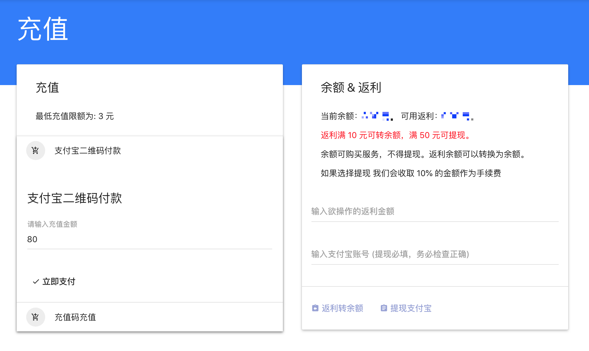
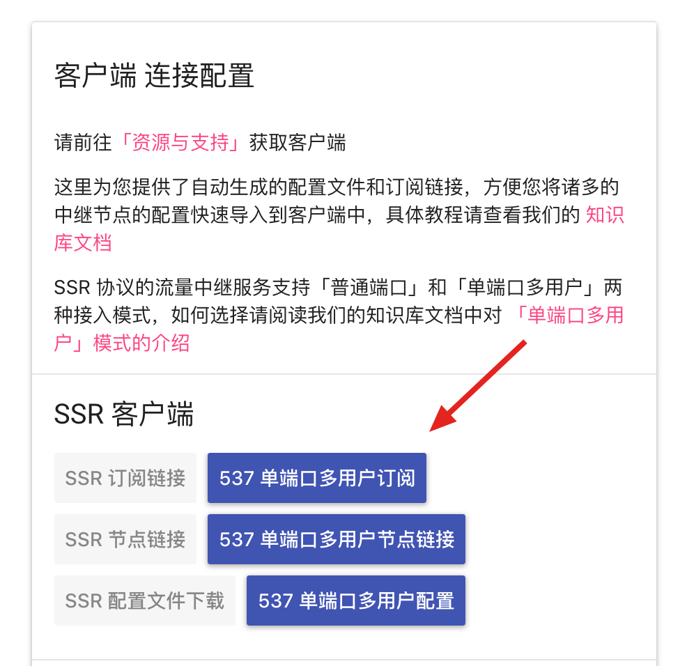

## 注册
[注册地址](https://cloudhammer.xyz/aff.html?invite=bq1ocvue)
## 充值及购买套餐
1. 注册成功并登录，进入[充值页面](https://console.cloudhammer.xyz/user/code)
2. 选择支付宝进行充值

3. 充值成功后会自动跳转到商品列表，根据自己的需求选择相应的套餐。
4. 以上都完成后，回到[用户中心](https://console.cloudhammer.xyz/user)。在『客户端 连接配置』卡片中，复制SSR订阅链接，把复制的内容粘贴到shadowsocks。

