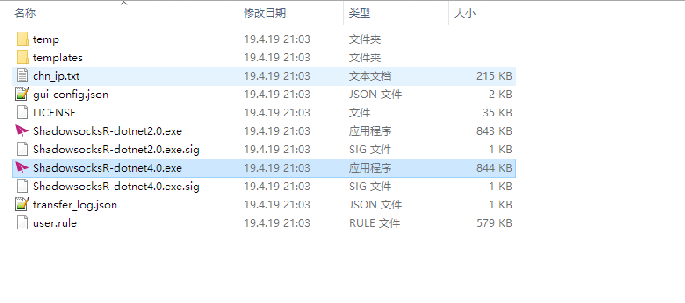
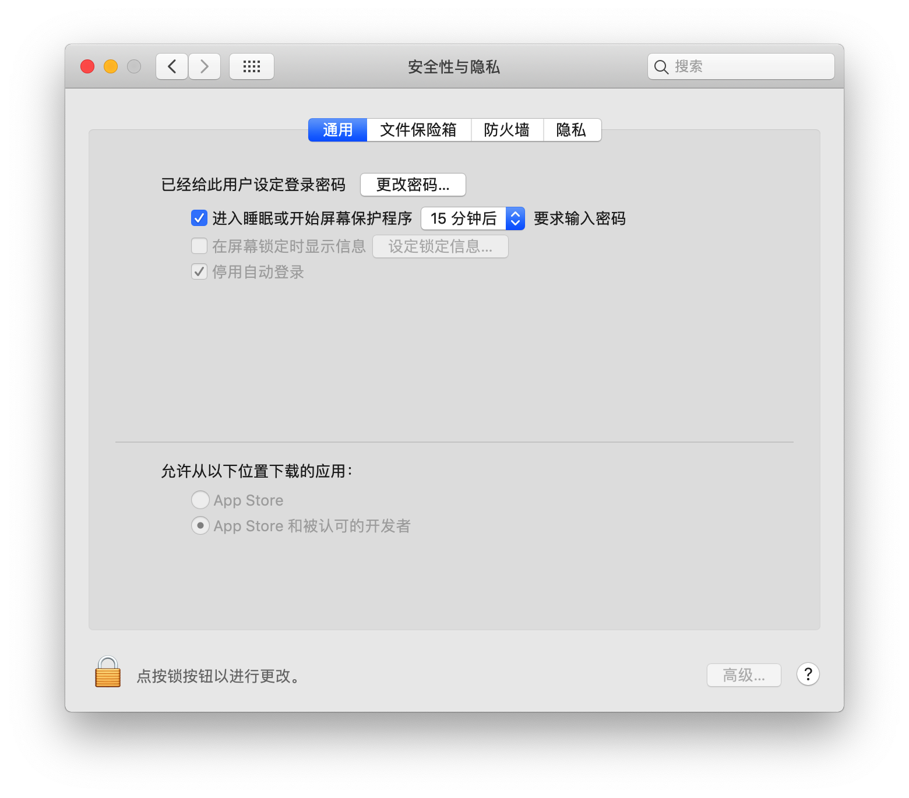

## windows
1. [下载地址](https://cloudhammer.xyz/integrations/)
2. 下载完成并解压后，打开**4.0版本**的应用程序。后面我们会用到服务器订阅功能，这个在旧版本里是没有的。

3. 暂时就没shadowsocks什么事了，先去🏃注册cloudHammer账号。一会儿还要回来哦。

---

## mac
1. [下载地址](https://cloudhammer.xyz/integrations/)
2. 打开dmg文件时，会发现安装不上。这是因为Mac OS会默认拦截未知来源的应用程序。只需要在系统设置的安全和隐私中，允许安装未知来源的应用程序，就可以了。

3. 同理。
